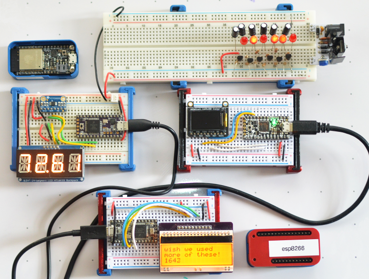
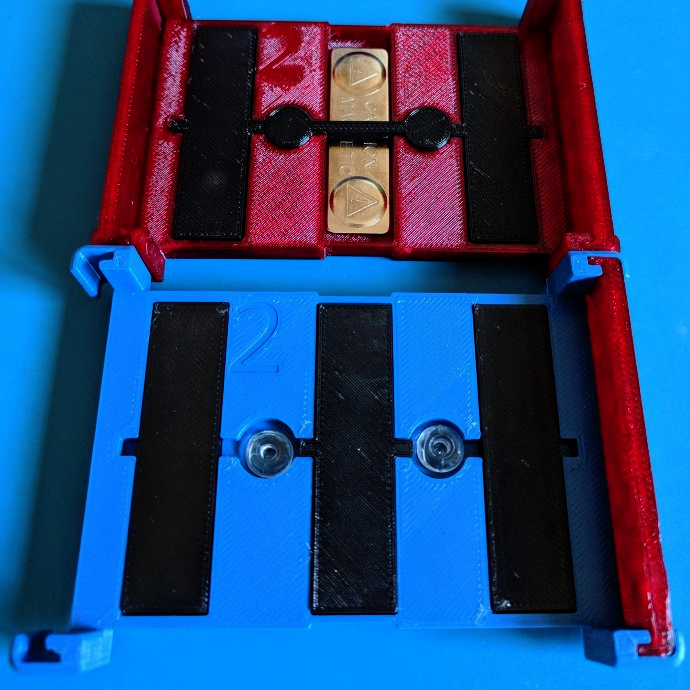

# Breadboard Mount

A magnetic/suction cup mount for 1/2 (half-sized) breadboards. For whiteboards and strange places.

These attachment methods were tested with this print:

* [Adams Manufacturing 7000-75-3040 Mini Suction Cup Hook, 3/4-Inch](https://smile.amazon.com/gp/product/B000BQQZCA/) - (The trick to getting these in is turning while pushing the stem in)

* [Badge Magnets](https://smile.amazon.com/totalElement-Magnetic-Fastener-Adhesive-10-Pack/dp/B00EHK287M/)

A STEP file `breadboard.step` is provided for remixing/modifying/experimenting!

### Printing

Some items are optional, but these are necessary for a full print:

* bumper-1.stl

* bumper-2.stl

* breadboard.stl

If a center-only badge magnet was chosen:

* center-retainer.stl

For more magnets (if you really need to hold something heavy):

* retainer-block2.stl

* retainer-block1.stl

And to block off the empty slots (for use with the adhesive foam pad on most breadboards):

* slot-cover-tabs.stl

### Credits

* Adafruit's [halfsize breadboard was used as a base for this model](https://github.com/adafruit/Adafruit_CAD_Parts/tree/master/64%20Halfsize%20Breadboard)
